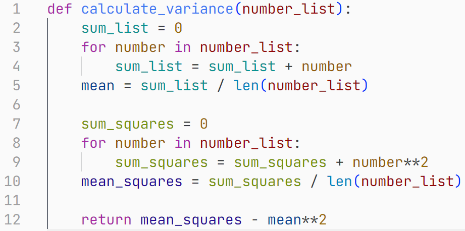

# 不同编程语言的代码规范

不同编程语言存在不同的“代码规范（Code Standards）”。有些编程语言官方便给出了详尽的规范，而有些则崇尚自由，存在社区中多个自发形成的不同规范。但是，不管怎样，你都应该坚守一个规范并坚持下来。

下面是一段典型的，比较符合 Python 代码规范 PEP 8 的 Python 代码。这段代码使用了格式化工具 autopep8 进行格式化。

而下面是一段遵循 LLVM 规范的 C++代码。这段代码使用了格式化工具 Clang-Format 进行格式化。

下面列出一些常见编程语言可选的代码规范。

- Python - [PEP 8](https://peps.python.org/pep-0008/)
- Java - [Google Java Style Guide](https://google.github.io/styleguide/javaguide.html) / [Alibaba Java Coding Guidelines](https://github.com/alibaba/Alibaba-Java-Coding-Guidelines)
- C++ - [LLVM Coding Standards](https://llvm.org/docs/CodingStandards.html) / [Google C++ Style Guide](https://google.github.io/styleguide/cppguide.html)
- C# - [C# Coding Conventions](https://learn.microsoft.com/en-us/dotnet/csharp/fundamentals/coding-style/coding-conventions)
- JavaScript/TypeScript - [Airbnb JavaScript Style Guide](https://github.com/airbnb/javascript) / [JavaScript Standard Style](https://standardjs.com/)
- Ruby - [Ruby Style Guide](https://rubystyle.guide/)
- Go - [Go Style](https://google.github.io/styleguide/go/)
- Rust - [Rust code formatting RFCs](https://github.com/rust-lang/style-team)
