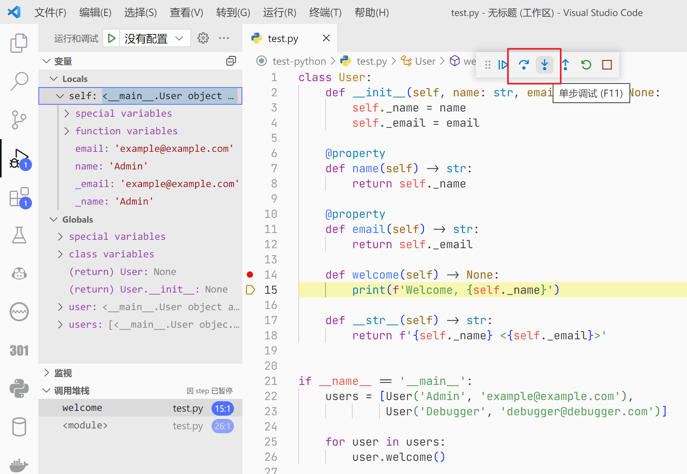

# 调试

## 断点调试

在多数情况下，你应该使用断点调试，而不是简单地向终端打印一堆调试信息。

上图展示了使用 VS Code 在 Python 中断点调试的一般流程：在行号前面单击打上“断点”，然后以调试模式运行程序（在 VS Code 中默认是 F5），就可以看到代码在运行到断点前被中断了，这时你可以看到当前程序中保存的变量、栈帧等信息——你不需要使用`print`语句，并且能够看到调试信息更加友好的表示形式。在调试模式运行的过程中，你可以看到编辑器/IDE 中会出现一个工具条。

红框圈出来的两个按钮从左到右分别是“单步跳过”与“单步调试”。点击“单步跳过，程序将直接运行当前行，并跳过这一行；而点击”单步调试“，如果这行语句调用了其他函数或方法等，会”跳入“所调用的函数中，让你进一步调试被调用函数的代码。不过在上面的示例中，由于这里没有调用什么其它函数，因此这两个按钮的作用是相似的。

善用断点调试可以有效帮助你提升修复 BUG 的效率，并且可以避免代码中大量乱糟糟的`print`出现。

## 网页调试

对于前端开发者，在浏览器中使用开发者工具进行网页调试是必备的技能。

点击键盘上的 F12，在“元素”页，你可以轻松调试网页中的元素和样式表，快速定位某一 HTML 网页元素。图中用红框圈出来的按钮点击后可以选中网页中某一个具体的元素，以获取它的详细信息。

在“网络”页，你可以查看所有网络请求的负载、相应与性能情况。实际上，很多爬虫也是这样工作的，相比于直接从网页上获取信息，这些爬虫开发者会查看网页与服务器之间的网络请求，并通过直接调用这些请求来获取信息。并且，对于一些保密性做得不太好的网站，其实你有时候也可以在这里看到一些本不该被你看到的信息。

而如果网页使用了特定的网页框架，如 React 或 Vue 等进行开发，通常推荐安装相应的浏览器插件以便调试。

