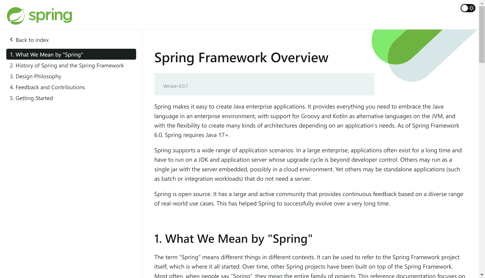

# 阅读官方文档

官方文档永远是最好、或者说至少是较好且稳妥的学习选择。阅读文档应当是一个计算机行业从业者所需的基本素养，并且应当尽量阅读官方的英文文档，因为中文文档总是存在翻译不及时产生的信息过时问题，而这有时候会带来更多的麻烦。

下面是前端流行框架 React 推出的最新官方文档。可以看到，它提供了一个叫做“Quick Start”的部分，帮助你快速入门这一框架。很多现代的编程语言、框架等都提供类似于“Quick Start”的部分，帮助你在几分钟至一小时不等的时间内快速掌握该语言或项目的基本用法，并且能够独立用这些知识编写一个完整的项目。而有些更人性化的文档，比如这里 React 的最新文档，还提供了交互式的代码编辑体验，你可以直接修改示例代码，并看到代码的展示效果，这对增进理解很有帮助。

可以看到，阅读文档并没有许多人想象的那么困难。许多现代的文档都为降低阅读门槛和提升阅读体验做了很大的努力，以至于现在的许多文档比起一份详尽冗长的“文档”，其实更接近于一份友好的“入门教程”。在这种情况下，如果文档已经很棒了，那么阅读文档通常就足够了，去阅读他人基于文档加工的二三手信息入门，反而不是个理智的选择。

而下图则展示了 Java 后端框架 Spring 的官方文档。该文档比起 React 这样的前端框架的文档要更枯燥与逊色一些，但也包含“Getting Started”部分，以指导读者快速入门 Spring 框架的使用。

