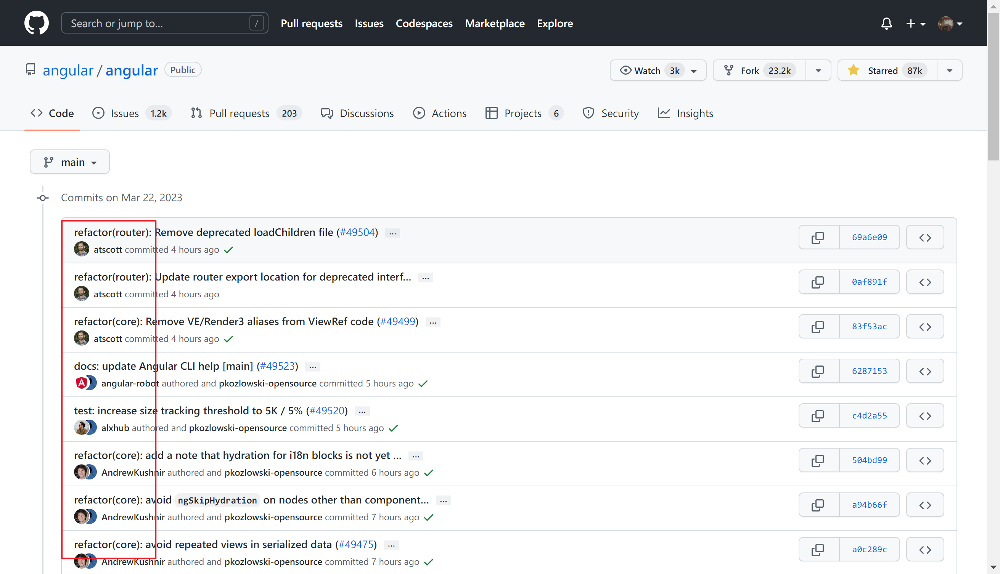
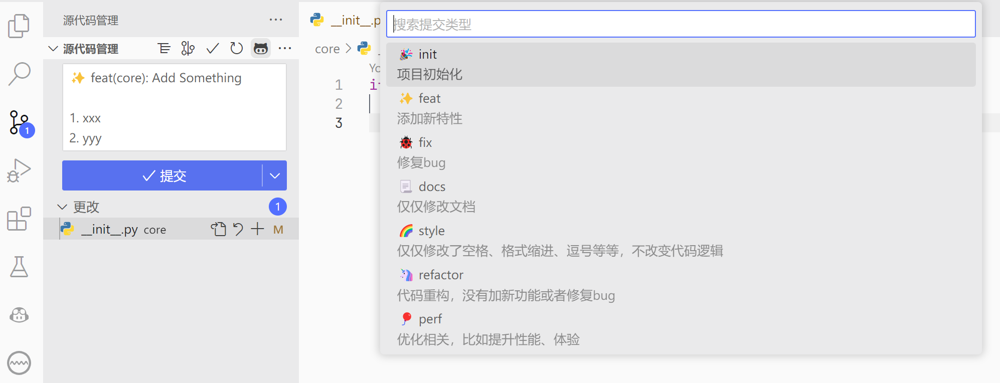

# Git - 你必须掌握的版本控制工具

## Git 简介

相信大家写代码时遇到过这样的问题（如果没有遇到，以后也会遇到的）：

- 代码东删西改，不知道什么时候改了哪里的代码。之前删掉了一段代码，突然想起来那段代码有用，可是却再也找不回来了
- 大家合作开发一个项目，我改一点，他改一点。大家通过 QQ 把代码压缩包传来传去，既不知道对方改了哪边，也不知道对方的代码有没有及时更新自己修改过的部分，整天都忙着整合代码，BUG 是谁写的也不知道。到头来代码没写多少，扯皮倒是扯了一堆

通常对于这种需要保留多个历史版本，并且需要多人合作的场景，我们使用**版本控制工具（Version Control System, VCS）** 进行管理。而 Git 就是当前最常用的版本控制工具。

## 安装

我个人建议 Windows 用户通过 Scoop 安装 Git，这样可以避免一些不必要的麻烦。关于 Scoop 的介绍参见[这里](../tools/scoop.md)。

下面是使用 Scoop 安装 Git 的命令：

```powershell
scoop install git
```

对于 Linux 用户，我想应该不用指导怎么安装 Git 了。而对于 macOS 用户，很遗憾，我没用过 macOS，所以无法提供相关安装方法。

## 基本命令

参考自[A Visual Git Reference](https://marklodato.github.io/visual-git-guide/index-en.html)

### init/add/commit


```bash
git init
git add .
git commit -m 'Version 1.0'
```

### diff


### merge


```bash
# Start a new feature
git checkout -b new-feature main
# Edit some files
git add <file>
git commit -m "Start a feature"
# Edit some files
git add <file>
git commit -m "Finish a feature"
# Merge in the new-feature branch
git checkout main
git merge new-feature
git branch -d new-feature
```

### clone/pull/push

```bash
git clone git@github.com:xxx/xxx.git
# Do something
...
# Push to repo
git push
# ...Or pull from repo
git pull
```

## Github


[GitHub](https://github.com/)是一个使用 Git 的**代码托管平台（Code Hosting Platform）**。目前，GitHub 是世界上最流行的代码托管平台，你可以在上面找到各种有价值的开源仓库。

同时，GitHub 也支持私有仓库，这可以帮助你与他人协作，或者仅仅作为你在多台电脑上同步代码的工具。

考虑到国内的网络情况，国内用户常使用[Gitee](https://gitee.com/)作为 GitHub 的替代品。

## Git Commit Template

关于要如何规范 Git 中提交（commit）时的信息格式，一直以来都是个比较让人头疼的问题。在很多项目中，尽管使用了 Git 做版本控制，但由于大家提交代码时都很随心所欲，提交信息（commit message）不能够清晰地表达本次提交所做的修改，因而仍旧不容易规范地管理仓库中的代码。

后来，为了解决这个问题，许多项目制定了对 commit message 格式的要求，甚至许多项目在将代码并入仓库前会检查 commit message 格式是否规范，如果不规范，则拒绝入库。而被大家普遍接受的一种格式是知名前端框架 Angular 仓库所采用的格式。这也被称为 Git Commit Template.



可以看到，在上图中，Angular 仓库的 commit message 看起来很清晰直观，这就是 Git Commit Template 带来的价值。

在 VS Code 中，可以通过 Git Commit Template 插件按照模板生成符合规范的 commit message.


