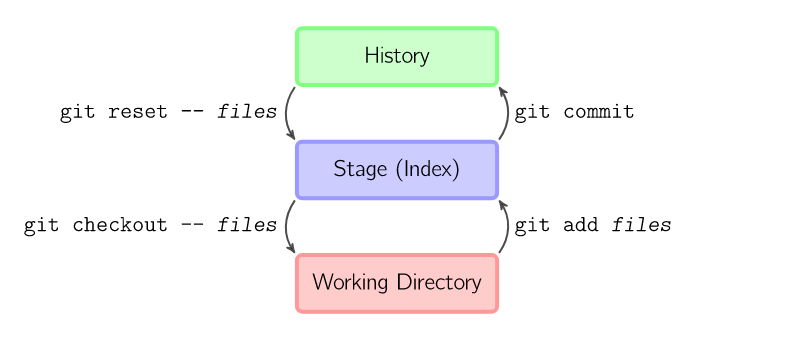
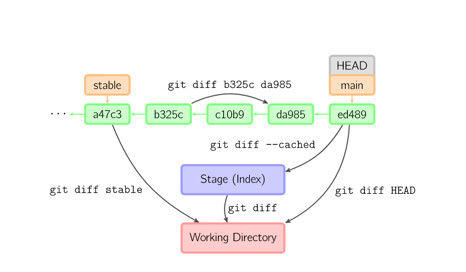

# 基本命令

参考自[A Visual Git Reference](https://marklodato.github.io/visual-git-guide/index-en.html)

### init/add/commit




```bash
git init
git add .
git commit -m 'Version 1.0'
```

### diff



### merge


```bash
# Start a new feature
git checkout -b new-feature main
# Edit some files
git add <file>
git commit -m "Start a feature"
# Edit some files
git add <file>
git commit -m "Finish a feature"
# Merge in the new-feature branch
git checkout main
git merge new-feature
git branch -d new-feature
```

### clone/pull/push

```bash
git clone git@github.com:xxx/xxx.git
# Do something
...
# Push to repo
git push
# ...Or pull from repo
git pull
```
