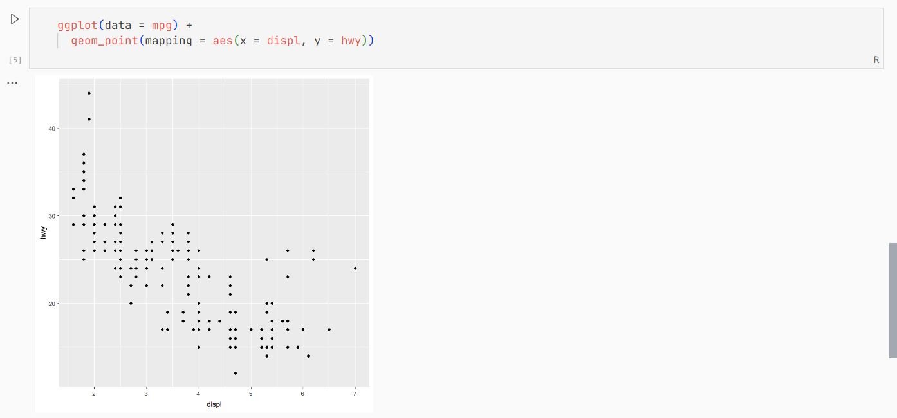

# 其他

## Markdown

Markdown 是一种简单的电子笔记形式，它的后缀名是`.md`。本文也是使用 Markdown 编写的。它的语法非常简单，其中基本的一些语法一张图就足以概括：

在程序员社区，Markdown 是必须要掌握的。当然，它掌握起来也非常简单，十分钟就可上手。

由于 Markdown 的简洁特性，得到了程序员社区的广泛喜爱。许多网站都支持甚至要求使用 Markdown 编写文章或回答，例如 Stack Overflow 的回答默认就是 Markdown 格式。同时，使用`README.md`作为说明，例如一个项目的简要说明甚至文档，也几乎已经成为社区中使用的惯例。

## Jupyter

Jupyter Notebook 是一种常用的**交互式编程**方式，尤其常见于数据科学领域。在 Jupyter Notebook 中，我们可以将代码段放在不同的单元格中，并且以任意顺序执行这些代码，同时看到（并保存）每一个单元格的输出结果。这种自由且方便的形式很受数据科学家喜爱。上图演示了 VS Code 中 Jupyter 的使用。

同时，Jupyter 还会通过变量表来补充智能提示。当你运行了某一个单元格后，其中你定义的变量会保存到变量表中，此时当你在 Jupyter 中编写代码时，就可以获取这个变量上的智能提示。这对于一些动态类型语言，例如 Python 来说，是非常方便的。

尽管人们常常将 Jupyter 与 Python 结合使用，但需要注意的是 Jupyter 并非仅适用于 Python。你可以通过为 Jupyter 安装其他编程语言的“**内核（Kernel）**”来将 Jupyter 应用于其他语言。这里是一个包含了大多数已经存在的[Jupyter Kernel 列表](https://github.com/jupyter/jupyter/wiki/Jupyter-kernels)。

下面简单演示了将 Jupyter 与 R 语言一起使用。

## 虚拟机与 Docker

很多时候，我们发布的软件要运行的平台与我们编写代码的平台不同。或者，有些代码要求只能在某个特定平台运行。这时候我们就需要一个“**虚拟机（Virtual Machine）**”（注意，这里不同于编程语言的虚拟机，主要是指操作系统虚拟机）。例如，有一个 C++代码库要求只能在 Linux 平台下编译，因此我们可以安装一个虚拟机软件，并添加一个 Linux 虚拟机，在其中编译 C++代码。

目前来说，如果你使用 Windows 10 及以上版本，可以不用安装特定的虚拟机软件。而是安装 WSL2（Windows Subsystem for Linux 2），这是一个嵌入 Windows 之中的 Linux 虚拟机，可以满足大多数在 Linux 平台下的编码需求。

除此之外，还有一种被称作“**容器（Container）**”的，比起虚拟机更为轻量的方式。Docker 就是其中的代表。使用 Docker，你可以直接新建一个“容器”，容器之间通常是相互隔离的，例如 A 容器中可以安装 Python2.7，而 B 容器中可以安装 Python3，分别可以包含不同的软件及运行环境。

容器是一种简化配置与部署的方式：当我们编写一个商业化的项目后，常常需要将打包好的可执行文件“部署”到特定的服务器上，而这个过程往往需要安装很多依赖、更新服务器上的特定库，并进行一系列的配置。而 Docker 提供了一种简单的方案：你可以新建一个 Dockerfile，在其中描述这个容器基于哪个已有的容器，比如一个安装了基本 Python 环境的基础容器，然后将这个容器中还需要安装哪些依赖、需要进行那些配置全部写进去。然后在服务器上，你只需要安装 Docker，然后指示 Docker 按照这个 Dockerfile 新建与配置一个容器，再把可执行文件放进去就可以了。

Docker 大大简化了应用的部署。事实上，在过去，如果遇到了很复杂的服务器配置，甚至会考虑使用虚拟机。然而 Docker 作为一种轻量化解决方案出现之后，这一问题得到了有效解决，这使得如今被大规模采用的服务器集群能够被很轻松地自动化管理，并且也促成了微服务的大规模流行。

其实我们在自己的个人电脑中，使用 Docker 也是很适合的。你可以使用 Docker 管理电脑上不同的代码该如何运行。并且，为你开源的某个软件提供一个 Dockerfile 也可以大大简化他人安装你软件的过程。

## CI/CD

“**持续集成（Continuous Integration, CI）**”和“**持续部署（Continuous Deployment, CD）**”是重要的自动化应用集成与部署的方案。

当程序规模变大之后，要管理多人协作和部署程序将变得很困难，而如何将这些工作与构建、测试等步骤整合到一起就更为困难。在传统的软件开发过程中，会有人员定期检查程序员们编写的代码，将它们人工整合到中央仓库中（比如使用 Git）；并且还会有人员定期运行测试、构建代码，然后将它们部署到服务器上进行实际测试。

然而，对于如今互联网的快速迭代，传统方式已经不适应了。许多互联网企业希望他们的产品代码能够不断集成到中央仓库、一天执行上百次测试并且一天进行数次甚至数十次部署。这时候，使用人工方式就不在现实了，因此出现了自动化的集成（将代码整合到中央仓库、并且进行测试、构建）和持续部署。我们常说的 DevOps 就包含了这两种技术。

一个流行的 CI/CD 工具是 Jenkins。它可以自动从 Git 仓库中获取代码，运行测试，进行构建，并且部署到服务器上。这类自动化工具大大提高了软件的迭代效率，目前已经被大多数成规模的互联网公司采用。甚至在如 Google 的超大型互联网公司中，还会有专业人员专门负责维护公司内 CI/CD 系统的正确运行。
