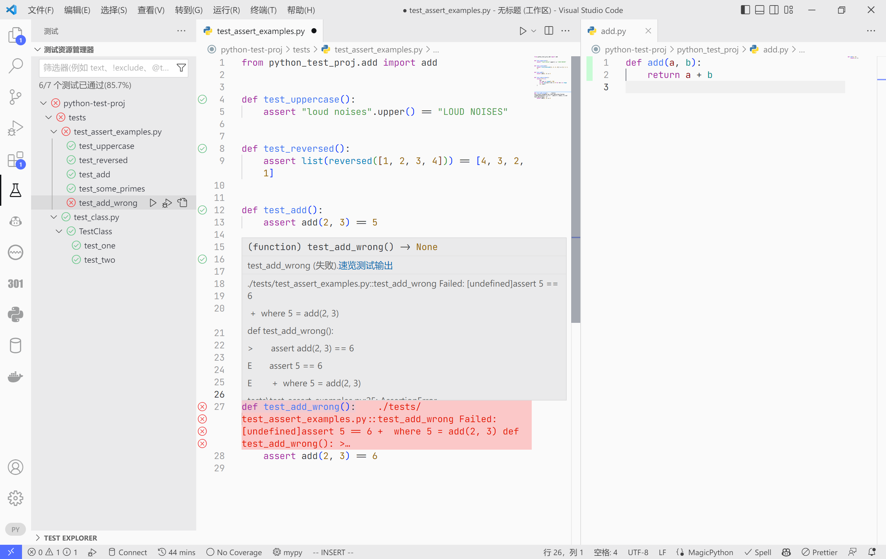
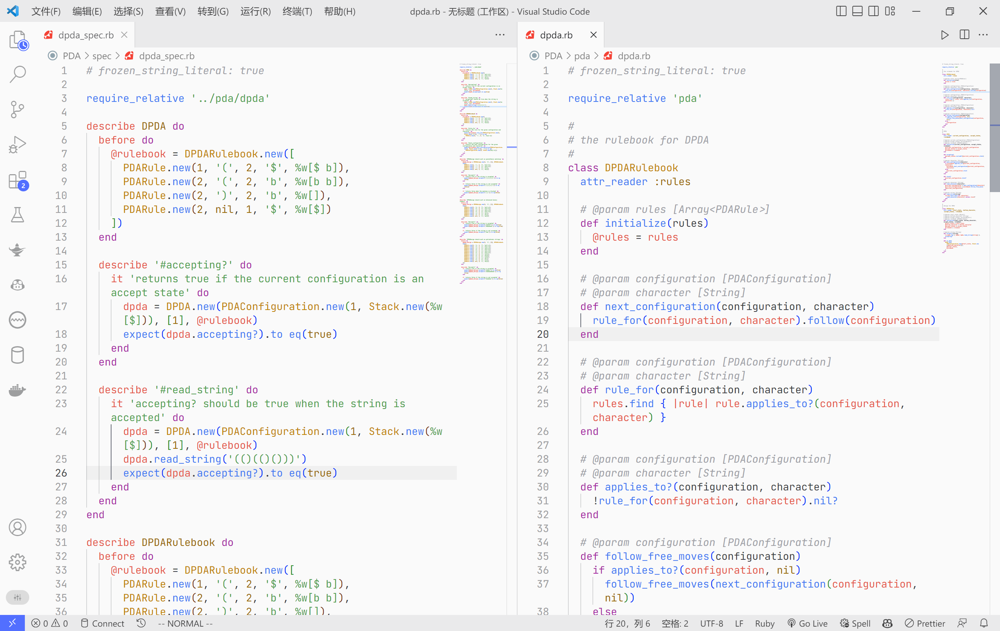

# 测试

对于任何重要的项目来说，测试都是不可忽视的部分。测试不仅重要在保证代码的完备性，也可以作为某种“文档”，告诉他人应该如何使用代码。

上图中演示了 Python 中最常用的测试框架 Pytest 的基本使用。可以看到，Pytest 给出了详细的测试报告，展示了哪些测试未通过，又是由于什么原因未通过的。测试代码本身也相当于一种文档，通过阅读测试代码，可以很容易地让接手项目的其他人快速了解被测试的函数/类等该如何使用。

同时，这里还使用 Pytest 生成了测试覆盖率文件。通过 VSCode 的 Coverage Gutters 插件，可以看到右边被测试的文件`add.py`中以绿色标记表明了那一行被测试代码完全覆盖了。除此之外，还有红色标记，表示代码未被测试覆盖，与黄色标记，表示存在条件分支未覆盖。

下面展示了一个典型的使用依赖管理工具 Poetry 建立的 Python 项目。在 Poetry 的项目结构中，我们将测试代码放在`./tests/`文件夹中。我们上面演示的测试代码就包含在这个示例项目中。许多工具，如 Java 的 Maven 也采用类似的项目结构，将测试代码与业务代码分开在两个不同的目录中。

Pytest 这样的测试风格是一种通用的测试风格，在 Java 最常用的测试框架 JUnit 中，也采用这种定义一个测试函数，并通过`assertXxx`函数来断言某种条件的方式进行测试。

但是，这不是唯一可行的测试风格，也有一种被称为“行为驱动开发（Behavior Driven Design, BDD）”的测试风格，它使用更贴近自然语言的写法对代码进行测试，比如 JavaScript 最常用的测试框架 Jest/Vitest、Ruby 最常用的测试框架 RSpec 等，就采用这种方式进行测试。

