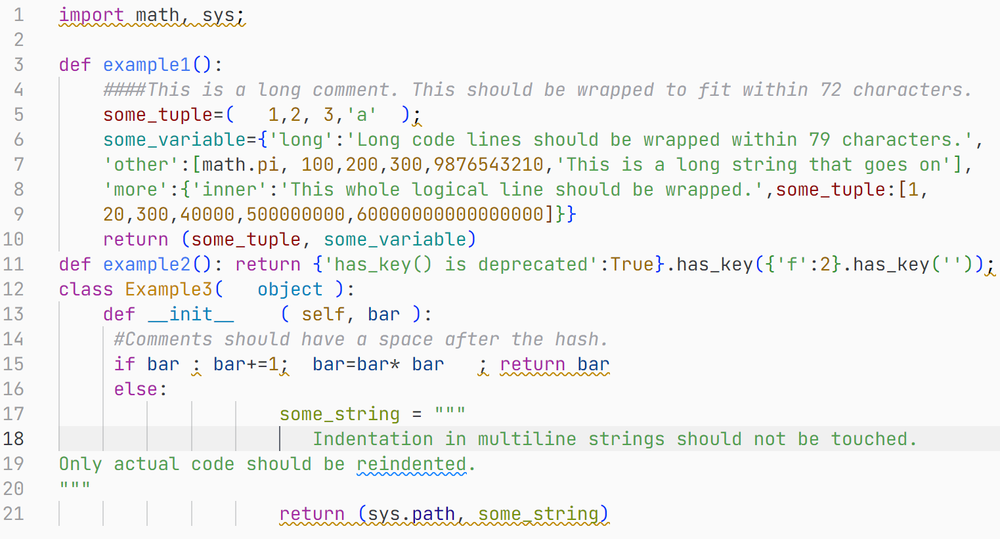
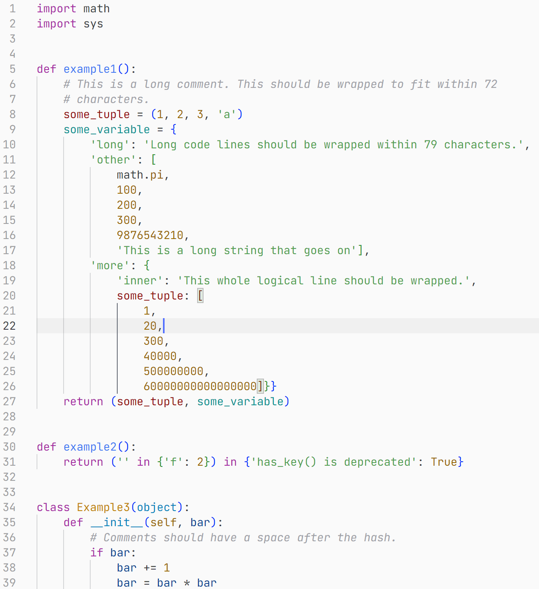

# 代码格式化工具（Formatter）

在[上一节](../coding-standards/README.md)中，我们提到了“代码规范（Code Standards）”的概念。然而，在实际的编程工作中，我们总是很难完全记住所有的代码规范。因此，出现了一些工具帮助我们在编写代码时自动遵守、或提示我们遵守代码规范。

这类工具通常包括“**代码格式化工具（Formatter）**”与“**代码检查工具（Linter）**”。本小节主要介绍代码格式化工具。

代码格式化工具（Formatter）是负责将代码按照某一标准进行格式化的工具。例如，下面是使用 Python 的代码格式化工具 autopep8 格式化一段糟糕的 Python 代码的示例。

下面列出一些编程语言常见的代码格式化工具。

- Python - Autopep8 / Black
- Java - Google Java Format
- C++ - Clang-Format
- JavaScript/TypeScript - Prettier
- Ruby - RuboCop
- Go - gofmt
- Rust - RustFmt
