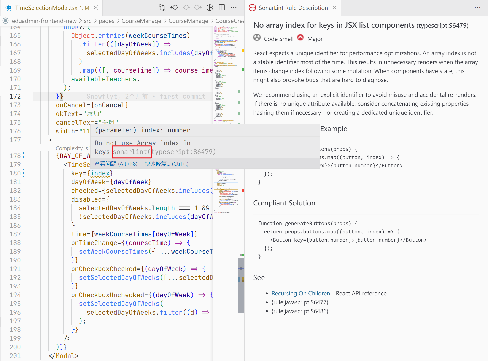

# 代码检查工具（Linter）

Linter 是一个不太容易翻译的词，有时我们将其翻译为“代码检查工具”，但更常见的做法其实是不翻译。简单来说，这是一种帮助你编写更好代码、以减少代码中潜在 BUG 的工具。Linter 中通常包含若干规则，如许多 Linter 会在函数的圈复杂度高于一定值时产生提示，建议你重构函数以降低代码复杂度。当然，也有许多针对不同编程语言的特定规则，如建议 Python 使用连续三个双引号而非单引号作为 docstring、对 Java 代码文件中潜在 null 值的检查、对 C++潜在内存泄漏问题的检测等。

一个比较知名的 Linter 是 SonarLint，它为多种不同的编程语言配置了大量规则。你可以在许多编辑器/IDE，比如 VSCode 和 IDEA 的插件市场中找到 SonarLint 插件并安装。

例如，在下面的 JavaScript 框架 React 的代码中，SonarLint 发现我们在 JSX 中传递节点数组时使用了数组下标作为 key，而这是不建议的做法。你可以打开 SonarLint 对这个规则的具体描述，看到为什么不建议这么做，与你可以怎么做来修正这段代码。

在下面这段 C++代码中，使用了 Clang-Tidy 作为 Linter，可以看到，我们在 main 函数中使用`new`在堆中分配了一个对象`h`，但却没有及时使用`delete`释放它。Clang-Tidy 检测到了这个问题，提示我们这里存在潜在的内存泄露风险，建议我们在使用`h`之后为其释放内存。

下面列出一些编程语言常见的 Linter.

- Python - Pylint / Ruff
- Java - Checkstyle / SpotBugs
- C++ - Clang-Tidy (clangd) / IntelliSense in Visual Studio
- JavaScript/TypeScript - ESLint
- Ruby - RuboCop
- Go - Golangci-lint
- Rust - Clippy
