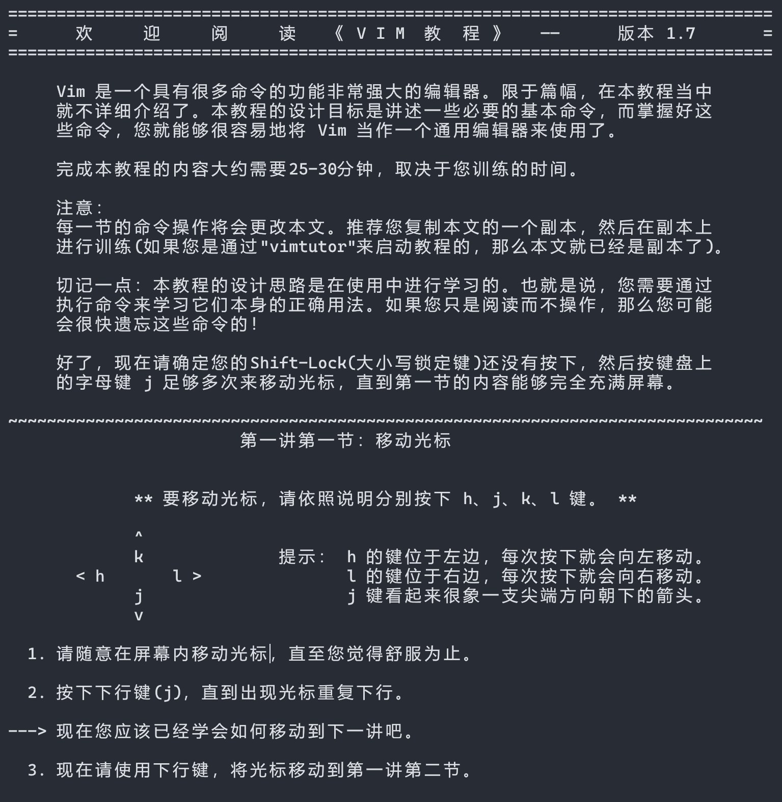

# Vim

图中是知名程序员问答网站 Stack Overflow 上的一个经典且著名的问题：我该如何退出 Vim？


这个问题提出于十年前，并且现在为止已经有了 280 万次的阅读量，这是一个很恐怖的数字。

为什么要学习 Vim？或者说，为什么需要了解一些 Vim 的基本操作？不是为了使用 Vim 提高你的“码字效率”——事实上，这因人而异，并不是所有人都认为 Vim 的编辑模式更加高效，而且如今纯粹使用 Vim 作为编辑器的程序员也已经很少了。但是，作为一个轻量的、可嵌入各类系统的编辑器，它几乎被安装在了任何 Linux 发行版乃至于其他许多系统的各类版本上。在大多数 Linux 系统中，都附带开箱即用的 Vi/Vim，并且有时你几乎只能使用 Vim。因而，了解 Vim 是必须的——至少可以让你在面对类似图中的这种情况时，不至于两眼抓瞎。

## 安装

我个人建议 Windows 用户通过 Scoop 安装 Vim，这样可以避免一些不必要的麻烦。关于 Scoop 的介绍参见[这里](../tools/scoop.md)。

下面是使用 Scoop 安装 Vim 的命令：

```powershell
scoop install vim
```

对于 Linux 用户，一般正常的 Linux 发行版都是自带 Vi/Vim 的，所以不用额外安装。如果你用的是不正常的发行版，那我想你应该能够自己搞定。而对于 macOS 用户，很遗憾，我没用过 macOS，所以无法提供相关安装方法。

另外，使用 Scoop 安装的 Vim 默认不带下面将提到的 vimtutor，如果你需要，可以通过下面的命令安装：

```powershell
scoop install vimtutor
```

不过使用 Scoop 安装的 vimtutor 是英文版的，如果你需要中文版，还是建议自己下载一份中文版的 vimtutor。下面会提到。

## 教程

在任何系统上，只要你安装了（或者系统附带了）Vim，通常都会包含一个`vimtutor`命令。在终端输入这个命令，你就可以得到一份简单的 vim 入门教程。你只需要花上三十到四十分钟，就能基本了解 vim 的常见命令。

```bash
vimtutor
```



> **Tips:**
> 如果你发现 vimtutor 是英文的，你也可以下载一个[中文版的 vimtutor](https://github.com/HanielF/VimTutor)，并用 Vim 打开它。
>
> ```bash
> vim vimtutor-cn.txt
> ```
