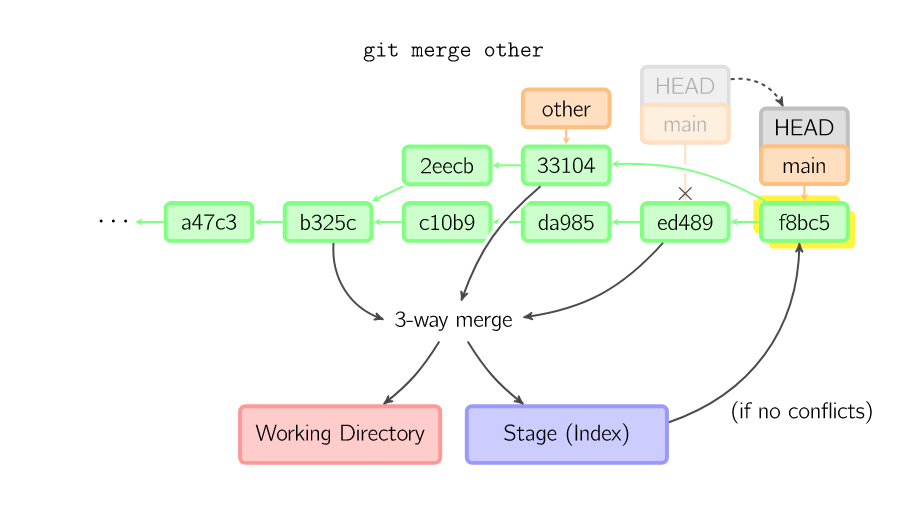
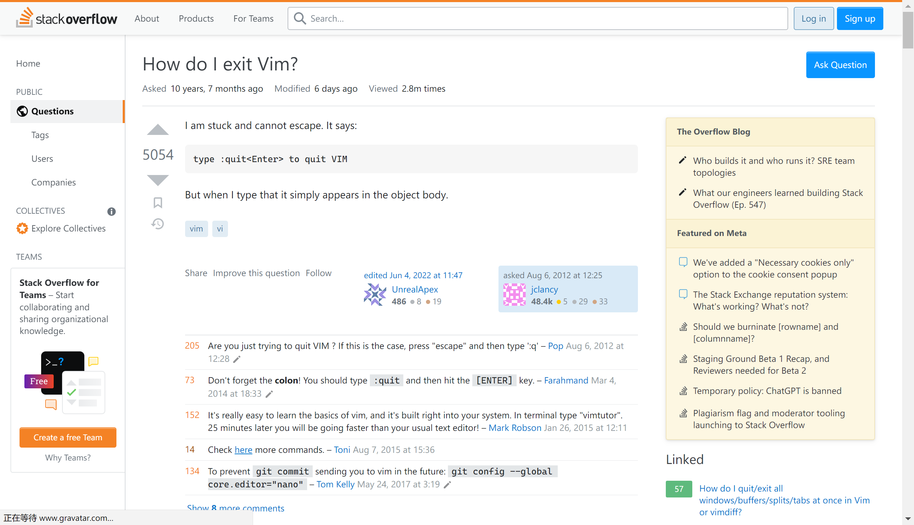
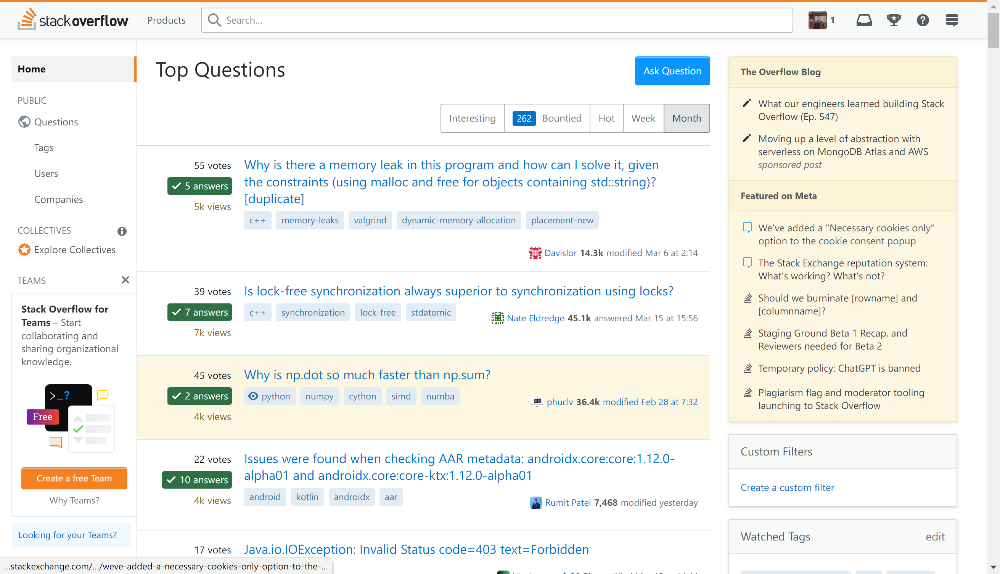

> 注：这是本文的最初版本，已经过时，放在这里仅作参考使用。建议访问根目录下的`SUMMARY.md`文件，开始阅读最新版本。

# Missing-Necessary-Knowledge-for-CS-Students

一份简短的介绍，包含了对于计算机系的大一学生来说可能有价值的、且老师通常不会讲授的知识。

## Scoop - Windows 上的包管理器

相信大家一定遇到过这样的烦恼：

- 想装个 Java，发现有一堆版本，还要折腾环境变量等各种设置，心力憔悴
- 电脑上装了 Python 3.11，打开别人给的代码，发现引用了某一个只支持 Python 3.8 及之前版本的库，还得把 Python 删了重装
- 电脑上各种编程语言和相关工具在 C 盘里到处乱飞，在 Program Files、Users\\\<username\>和 AppData 里遍地开花，完全搞不清楚装在哪里以及它下载的文件在哪儿放着

这时候你就需要一个包管理器解决问题，一键安装和卸载、多版本共存、统一管理……如果有用过 macOS 的 homebrew、Ubuntu 的 apt、CentOS 的 yum 或 Arch 的 Pacman 的同学，一定能体验到对于一个经常和这些编程工具打交道的人来说，有一个包管理器是多么爽的一件事

那么 Windows 下有没有包管理器呢？当然是有的，而且比很多 Linux 下的包管理器还好用，它就是 Scoop。这是它的[官网](https://scoop.sh/)


我个人建议以管理员身份安装，并且将它默认的安装文件夹改到 C:\\Scoop\\，这样会方便管理一些。以管理员身份打开 Powershell，输入以下命令

```powershell
irm get.scoop.sh -outfile 'install.ps1'
.\install.ps1 -RunAsAdmin -ScoopDir 'C:\Scoop'
```

等待一会儿（可能需要挂代理），然后你就会发现 Scoop 已经自动装好了。现在再打开 Powershell，输入`scoop`，你应该能看到提示信息了。

> **Tips:**
> 如果你的网络状态不足以正常安装 Scoop 及访问 Scoop 仓库（Bucket），请搜索“Scoop 配置国内镜像”并按照相关教程自行配置镜像。

Scoop 默认的 main 仓库可以安装的软件比较少，我推荐添加下面几个仓库：

```powershell
scoop bucket add java
scoop bucket add extras
scoop bucket add dorado https://github.com/chawyehsu/dorado
```

其中 extras 是 Scoop 官方维护的仓库，包含了比 main 更多的软件包。而 dorado 是国内开发者维护的仓库，包含了许多适合国内用户使用的软件包。而 java，顾名思义，包含了许多与 Java 有关的软件包。

你可以用 Scoop 安装大多数编程领域的相关工具，包括但不限于：

```powershell
scoop install git
scoop install miniconda3
scoop install python
scoop install poetry
scoop install temurin8-jdk
scoop install openjdk11
scoop install openjdk17
scoop install maven
scoop install gradle
scoop install mingw
scoop install msys2
scoop install gcc
scoop install llvm
scoop install nodejs
scoop install npm
scoop install yarn
scoop install sqlite
scoop install draw.io
...
```

同时，你可以一键升级所有当前通过 Scoop 安装的软件：

```powershell
scoop update *
```

搜索软件包：

```powershell
scoop search python
```

卸载软件包：

```powershell
scoop uninstall python
```

你可以同时用 Scoop 安装多个版本的软件，如 Java：

```powershell
scoop install temurin8-jdk
scoop install openjdk11
scoop install openjdk17
```

在上面的例子中，我们同时安装了 Java 8、11 和 17。你可以运行`scoop reset xxx`来重新配置某一个软件包的环境，以实现“切换版本”的功能：

```powershell
scoop reset temurin8-jdk
java -version # openjdk version "1.8.0_362"
scoop reset openjdk17
java -version # openjdk version "17.0.2"
```

你也可以选择安装某个特定版本的软件包，并且让 Scoop 不再更新它的版本，以保持稳定：

```powershell
scoop install maven@3.6.3
scoop hold maven
```

添加`vesions`仓库以获取更多不同版本的软件包：

```powershell
scoop bucket add versions
scoop install python38 python
scoop reset python38
python --version # Python 3.8.10
scoop reset python
python --version # Python 3.11.2
```

你甚至可以自定义仓库，或者寻找别人做好的仓库，用 Scoop 管理你电脑上几乎一切软件。不过，讲座时间有限，我就不展开了，大家感兴趣的话可以去看看 Scoop 的[官方文档](https://scoop-docs.vercel.app/docs/getting-started/Quick-Start.html)

## Git 扫盲

### Git 简介

相信大家写代码时遇到过这样的问题（如果没有遇到，以后也会遇到的）：

- 代码东删西改，不知道什么时候改了哪里的代码。之前删掉了一段代码，突然想起来那段代码有用，可是却再也找不回来了
- 大家合作开发一个项目，我改一点，他改一点。大家通过 QQ 把代码压缩包传来传去，既不知道对方改了哪边，也不知道对方的代码有没有及时更新自己修改过的部分，整天都忙着整合代码，BUG 是谁写的也不知道。到头来代码没写多少，扯皮倒是扯了一堆

通常对于这种需要保留多个历史版本，并且需要多人合作的场景，我们使用**版本控制工具（Version Control System, VCS）** 进行管理。而 Git 就是当前最常用的版本控制工具。

### 安装

```powershell
scoop install git
```

### 基本命令

参考自[A Visual Git Reference](https://marklodato.github.io/visual-git-guide/index-en.html)

#### init/add/commit


```bash
git init
git add .
git commit -m 'Version 1.0'
```

#### diff


#### merge



```bash
# Start a new feature
git checkout -b new-feature main
# Edit some files
git add <file>
git commit -m "Start a feature"
# Edit some files
git add <file>
git commit -m "Finish a feature"
# Merge in the new-feature branch
git checkout main
git merge new-feature
git branch -d new-feature
```

#### clone/pull/push

```bash
git clone git@github.com:xxx/xxx.git
# Do something
...
# Push to repo
git push
# ...Or pull from repo
git pull
```

### Github


[GitHub](https://github.com/)是一个使用 Git 的**代码托管平台（Code Hosting Platform）**。目前，GitHub 是世界上最流行的代码托管平台，你可以在上面找到各种有价值的开源仓库。

同时，GitHub 也支持私有仓库，这可以帮助你与他人协作，或者仅仅作为你在多台电脑上同步代码的工具。

考虑到国内的网络情况，国内用户常使用[Gitee](https://gitee.com/)作为 GitHub 的替代品。

### Git Commit Template

关于要如何规范 Git 中提交（commit）时的信息格式，一直以来都是个比较让人头疼的问题。在很多项目中，尽管使用了 Git 做版本控制，但由于大家提交代码时都很随心所欲，提交信息（commit message）不能够清晰地表达本次提交所做的修改，因而仍旧不容易规范地管理仓库中的代码。

后来，为了解决这个问题，许多项目制定了对 commit message 格式的要求，甚至许多项目在将代码并入仓库前会检查 commit message 格式是否规范，如果不规范，则拒绝入库。而被大家普遍接受的一种格式是知名前端框架 Angular 仓库所采用的格式。这也被称为 Git Commit Template.


可以看到，在上图中，Angular 仓库的 commit message 看起来很清晰直观，这就是 Git Commit Template 带来的价值。

在 VS Code 中，可以通过 Git Commit Template 插件按照模板生成符合规范的 commit message.


## Vim

图中是知名程序员问答网站 Stack Overflow 上的一个经典且著名的问题：我该如何退出 Vim？



这个问题提出于十年前，并且现在为止已经有了二百八十万次的阅读量，这是一个很恐怖的数字。

为什么要学习 Vim？或者说，为什么需要了解一些 Vim 的基本操作？不是为了使用 Vim 提高你的“码字效率”——事实上，这因人而异，并不是所有人都认为 Vim 的编辑模式更加高效，而且如今纯粹使用 Vim 作为编辑器的程序员也已经很少了。但是，作为一个轻量的、可嵌入各类系统的编辑器，它几乎被安装在了任何 Linux 发行版乃至于其他许多系统的各类版本上。在大多数 Linux 系统中，都附带开箱即用的 Vi/Vim，并且有时你几乎只能使用 Vim。因而，了解 Vim 是必须的——至少可以让你在面对类似图中的这种情况时，不至于两眼抓瞎。

### 安装

```powershell
scoop install vim
```

### 教程

在任何系统上，只要你安装了（或者系统附带了）Vim，通常都会包含一个`vimtutor`命令。在终端输入这个命令，你就可以得到一份简单的 vim 入门教程。你只需要花上三十到四十分钟，就能基本了解 vim 的常见命令。

```bash
vimtutor
```


_如果你发现 vimtutor 是英文的，你也可以下载一个[中文版的 vimtutor](https://github.com/HanielF/VimTutor)，并用 Vim 打开它_

```bash
vim vimtutor-cn.txt
```

## 检索、调试与测试

### 学会检索

#### 使用英文检索

使用英文进行检索是比使用中文检索要**有效率得多**的方式。这主要是由于中文程序员社区存在大量重复性较高且过时的信息。对于常见的问题，直接将错误信息粘贴到百度或许能够解决问题。但我们总会遇到稍小众一些的问题，并且很多时候中文社区容易找到过时的信息，且没有充分的解释，容易产生误导。因此，学会使用英文检索是必须的。


这听起来似乎有些难度，但其实做起来很简单。只要你坚持两三天，你很快就会意识到这样做的必要性与意义。

#### 关注程序员社区

关注程序员社区总能帮助你扩展视野——或者至少能帮助你解决实际问题。下图是最著名的英文程序员问答网站 Stack Overflow 上的一张截图。该网站包含了几乎所有你可能遇到的程序员问题的解答，是一个合格程序员所必备的网站——当然，通常你不需要直接在这上边搜索问题，当你在谷歌或者必应国际版上用英文搜索程序员相关的问题时，Stack Overflow 的解答总是能出现在一个相当靠前的位置，并且完美地解答你的问题。



下面是一些常见的程序员社区（但其中有些并非专门针对程序员的社区）：

- Stack Overflow / Stack Exchange
- Medium
- Dev.to
- r/programming

### 阅读文档

官方文档永远是最好、或者说至少是较好且稳妥的学习选择。阅读文档应当是一个计算机行业从业者所需的基本素养，并且应当尽量阅读官方的英文文档，因为中文文档总是存在翻译不及时产生的信息过时问题，而这有时候会带来更多的麻烦。

下面是前端流行框架 React 推出的最新官方文档。可以看到，它提供了一个叫做“Quick Start”的部分，帮助你快速入门这一框架。很多现代的编程语言、框架等都提供类似于“Quick Start”的部分，帮助你在几分钟至一小时不等的时间内快速掌握该语言或项目的基本用法，并且能够独立用这些知识编写一个完整的项目。而有些更人性化的文档，比如这里 React 的最新文档，还提供了交互式的代码编辑体验，你可以直接修改示例代码，并看到代码的展示效果，这对增进理解很有帮助。

可以看到，阅读文档并没有许多人想象的那么困难。许多现代的文档都为降低阅读门槛和提升阅读体验做了很大的努力，以至于现在的许多文档比起一份详尽冗长的“文档”，其实更接近于一份友好的“入门教程”。在这种情况下，如果文档已经很棒了，那么阅读文档通常就足够了，去阅读他人基于文档加工的二三手信息入门，反而不是个理智的选择。


而下图则展示了 Java 后端框架 Spring 的官方文档。该文档比起 React 这样的前端框架的文档要更枯燥与逊色一些，但也包含“Getting Started”部分，以指导读者快速入门 Spring 框架的使用。


### 断点调试

在多数情况下，你应该使用断点调试，而不是简单地向终端打印一堆调试信息。


上图展示了使用 VS Code 在 Python 中断点调试的一般流程：在行号前面单击打上“断点”，然后以调试模式运行程序（在 VS Code 中默认是 F5），就可以看到代码在运行到断点前被中断了，这时你可以看到当前程序中保存的变量、栈帧等信息——你不需要使用`print`语句，并且能够看到调试信息更加友好的表示形式。在调试模式运行的过程中，你可以看到编辑器/IDE 中会出现一个工具条。

红框圈出来的两个按钮从左到右分别是“单步跳过”与“单步调试”。点击“单步跳过，程序将直接运行当前行，并跳过这一行；而点击”单步调试“，如果这行语句调用了其他函数或方法等，会”跳入“所调用的函数中，让你进一步调试被调用函数的代码。不过在上面的示例中，由于这里没有调用什么其它函数，因此这两个按钮的作用是相似的。

善用断点调试可以有效帮助你提升修复 BUG 的效率，并且可以避免代码中大量乱糟糟的`print`出现。

### 网页调试

对于前端开发者，在浏览器中使用开发者工具进行网页调试是必备的技能。

点击键盘上的 F12，在“元素”页，你可以轻松调试网页中的元素和样式表，快速定位某一 HTML 网页元素。图中用红框圈出来的按钮点击后可以选中网页中某一个具体的元素，以获取它的详细信息。


在“网络”页，你可以查看所有网络请求的负载、相应与性能情况。实际上，很多爬虫也是这样工作的，相比于直接从网页上获取信息，这些爬虫开发者会查看网页与服务器之间的网络请求，并通过直接调用这些请求来获取信息。并且，对于一些保密性做得不太好的网站，其实你有时候也可以在这里看到一些本不该被你看到的信息。


而如果网页使用了特定的网页框架，如 React 或 Vue 等进行开发，通常推荐安装相应的浏览器插件以便调试。


### 测试

对于任何重要的项目来说，测试都是不可忽视的部分。测试不仅重要在保证代码的完备性，也可以作为某种“文档”，告诉他人应该如何使用代码。


上图中演示了 Python 中最常用的测试框架 Pytest 的基本使用。可以看到，Pytest 给出了详细的测试报告，展示了哪些测试未通过，又是由于什么原因未通过的。测试代码本身也相当于一种文档，通过阅读测试代码，可以很容易地让接手项目的其他人快速了解被测试的函数/类等该如何使用。

同时，这里还使用 Pytest 生成了测试覆盖率文件。通过 VSCode 的 Coverage Gutters 插件，可以看到右边被测试的文件`add.py`中以绿色标记表明了那一行被测试代码完全覆盖了。除此之外，还有红色标记，表示代码未被测试覆盖，与黄色标记，表示存在条件分支未覆盖。

下面展示了一个典型的使用依赖管理工具 Poetry 建立的 Python 项目。在 Poetry 的项目结构中，我们将测试代码放在`./tests/`文件夹中。我们上面演示的测试代码就包含在这个示例项目中。许多工具，如 Java 的 Maven 也采用类似的项目结构，将测试代码与业务代码分开在两个不同的目录中。


Pytest 这样的测试风格是一种通用的测试风格，在 Java 最常用的测试框架 JUnit 中，也采用这种定义一个测试函数，并通过`assertXxx`函数来断言某种条件的方式进行测试。


但是，这不是唯一可行的测试风格，也有一种被称为“行为驱动开发（Behavior Driven Design, BDD）”的测试风格，它使用更贴近自然语言的写法对代码进行测试，比如 JavaScript 最常用的测试框架 Jest/Vitest、Ruby 最常用的测试框架 RSpec 等，就采用这种方式进行测试。


## 代码与项目规范

> Quick & dirty. Dijkstra would not like it. — Edsger W. Dijkstra

### 不同编程语言的代码规范

不同编程语言存在不同的代码规范。有些编程语言官方便给出了详尽的规范，而有些则崇尚自由，存在社区中多个自发形成的不同规范。但是，不管怎样，你都应该坚守一个规范并坚持下来。

下面是一段典型的，比较符合 Python 代码规范 PEP 8 的 Python 代码。这段代码使用了格式化工具 autopep8 进行格式化。


而下面是一段遵循 LLVM 规范的 C++代码。这段代码使用了格式化工具 Clang-Format 进行格式化。


下面列出一些常见编程语言可选的代码规范。

- Python - [PEP 8](https://peps.python.org/pep-0008/)
- Java - [Google Java Style Guide](https://google.github.io/styleguide/javaguide.html) / [Alibaba Java Coding Guidelines](https://github.com/alibaba/Alibaba-Java-Coding-Guidelines)
- C++ - [LLVM Coding Standards](https://llvm.org/docs/CodingStandards.html) / [Google C++ Style Guide](https://google.github.io/styleguide/cppguide.html)
- C# - [C# Coding Conventions](https://learn.microsoft.com/en-us/dotnet/csharp/fundamentals/coding-style/coding-conventions)
- JavaScript/TypeScript - [Airbnb JavaScript Style Guide](https://github.com/airbnb/javascript) / [JavaScript Standard Style](https://standardjs.com/)
- Ruby - [Ruby Style Guide](https://rubystyle.guide/)
- Go - [Go Style](https://google.github.io/styleguide/go/)
- Rust - [Rust code formatting RFCs](https://github.com/rust-lang/style-team)

### 格式化工具（Formatter）与 Linter

把代码规范浏览一遍是可行的，但是要把规范中的每一条都完全记住总是不太可能的。并且，时时关注代码格式，以使其符合规范也是一件相当困难的事情。不过，这些工作通常都不需要我们去人工记忆与完成，代码格式化工具（Formatter）与 Linter 将为我们完成这些工作。

#### 格式化工具（Formatter）

代码格式化工具（Formatter）负责将代码按照某一标准进行格式化。下面是使用 autopep8 格式化一段糟糕的 Python 代码的示例。


下面列出一些编程语言常见的代码格式化工具。

- Python - Autopep8 / Black
- Java - Google Java Format
- C++ - Clang-Format
- JavaScript/TypeScript - Prettier
- Ruby - RuboCop
- Go - gofmt
- Rust - RustFmt

#### Linter

Linter 是一个不太容易翻译的词。简单来说，这是一种帮助你编写更好代码、以减少代码中潜在 BUG 的工具。Linter 中通常包含若干规则，如许多 Linter 会在函数的圈复杂度高于一定值时产生提示，建议你重构函数以降低代码复杂度。当然，也有许多针对不同编程语言的特定规则，如建议 Python 使用连续三个双引号而非单引号作为 docstring、对 Java 代码文件中潜在 null 值的检查、对 C++潜在内存泄漏问题的检测等。

一个比较知名的 Linter 工具是 SonarLint，它为多种不同的编程语言配置了大量规则。你可以在许多编辑器/IDE，比如 VSCode 和 IDEA 的插件市场中找到 SonarLint 插件并安装。

例如，在下面的 JavaScript 框架 React 的代码中，SonarLint 发现我们在 JSX 中传递节点数组时使用了数组下标作为 key，而这是不建议的做法。你可以打开 SonarLint 对这个规则的具体描述，看到为什么不建议这么做，与你可以怎么做来修正这段代码。


在下面这段 C++代码中，使用了 Clang-Tidy 作为 Linter，可以看到，我们在 main 函数中使用`new`在堆中分配了一个对象`h`，但却没有及时使用`delete`释放它。Clang-Tidy 检测到了这个问题，提示我们这里存在潜在的内存泄露风险，建议我们在使用`h`之后为其释放内存。


下面列出一些编程语言常见的 Linter 工具。

- Python - Pylint / Ruff
- Java - Checkstyle / SpotBugs
- C++ - Clang-Tidy (clangd) / IntelliSense in Visual Studio
- JavaScript/TypeScript - ESLint
- Ruby - RuboCop
- Go - Golangci-lint
- Rust - Clippy

### 包管理器、依赖管理与打包工具

对于初学者来说，“包管理器”、“依赖管理”、“打包工具”这几个概念是困惑且容易混淆的。并且，实际上很多工具本就“身兼多职”，也没有明确的角色区分，这进一步导致了这些概念上的混乱。在这里，我按个人的主观意见将这些工具归类为了这三种，但实际上对于相应的归类，一直没有个明确的说法。

我们常说的“包管理器”，可能指系统上的软件管理器，例如 Ubuntu 的 apt、CentOS 的 yum 与 ArchLinux 的 pacman，也可能指编程语言中的库管理器，通常是第三方库，比如 Python 自带的 Pip、JavaScript 生态中的 npm、Java 生态中的 Maven 等。对于后者，通常支持从网络中（一般是某个仓库网站，比如 Python 的 PyPI、Maven 的 MVN Repository 等）直接安装第三方库到本地。这样就可以免于繁琐的、在网络上寻找他人写好的库并费劲周折安装到你自己电脑上的麻烦。

还有一种被我称作“依赖管理”的工具，为一个个具体的代码项目工作，管理一个项目中所有的库，或者叫做“依赖”。这主要是由于不同的项目往往使用不同的编程语言版本甚至不同的第三方库版本，并且有独立的环境配置，如果让电脑上的所有项目都使用全局安装的库，就很容易出现不兼容问题，甚至因为编程语言版本不对而压根跑不起来。因此，通常的做法是为每一个项目单独管理一份环境，也就是“依赖管理”。实际上，大多数包管理器具有依赖管理的功能，比如 Maven、npm 这些工具天生就是“身兼数职”的工具，本就是为管理具体的某一项目而设计的，至于全局库的管理，反倒是顺带的。甚至，其实 Python 自带的 Pip 也有一定的“依赖管理”能力，Pip 可以通过建立一个虚拟环境为某个具体的项目安装特定版本的第三方库。只是 Pip 自身的依赖管理能力比较羸弱，存在很大缺陷，并且很难使用不同版本的 Python，因此出现了 Conda、Poetry 等解决方案提供更现代化的依赖管理能力。

然后是“打包工具”，它的职责是将代码“打包”成特定平台上可执行的文件，比如 Windows 上的 exe 或是运行在 Java 虚拟机中的.jar 文件等。实际上这也是一个比较模糊的职责，比如 Maven 也同时具有打包功能，可以直接将你的 Java 项目代码打包成一个 jar 包。而上面提到的 Poetry 也同样具有打包能力。但是在有些编程语言生态中，“打包”这一职责通常使用专门的工具，比如 JavaScript 生态中由于要涉及到极其复杂的浏览器兼容工作，打包工具通常都是独立且复杂性极高的，作为单独的工具而存在，并且存在多种不同的打包工具，比如 Webpack 和 Vite。而在 C++中，著名的打包工具 CMake 也主要是作为一个打包工具而存在，以实现 C++代码的跨平台编译，不负责太多其他功能。

这里的东西听起来或许还是太过抽象了，但是只要是实际上上手其中的某一个或几个工具，尝试完成一个规范的项目，就会很容易理解这些内容。

下面是一些编程语言中常见的相关工具。

- Python - Pip / Conda | Poetry
- Java - Maven / Gradle / Ant / Eclipse
- C++ - vcpkg | CMake / XMake
- C# - NuGet
- JavaScript - npm / Yarn / pnpm | Webpack / Vite / ESBuild / SWC | Babel / TypeScript
- Ruby - RubyGems | Bundler
- Go - Go Package
- Rust - Cargo

### 注释与文档

编写注释似乎是人人都会做的事情，但真要写好注释却是非常困难的事情。

```python
'''Bad: Use lowercase letter at the beginning of a comment'''
# get user input
n,*vals=map(int,input().split())

'''Good: Always begin a comment with an uppercase letter'''
# Get user input
n, *vals = map(int, input().split())
```

```python
'''Bad: Ambiguous variable name with explanation'''
s = num1 + num2 # Sum of the two numbers

'''Good: Just use explanatory variable names without comments as explanation'''
sum_of_nums = num1 + num2
```

```python
'''Bad: Worthless comments'''
# Add num1 with num2 and assign the result to sum_of_nums
sum_of_nums = num1 + num2

'''Good: Just remove those useless comments'''
sum_of_nums = num1 + num2
```

```python
'''Worse: Misleading / Outdated comments'''
def process_nums(nums):
    """Return odd nums in the sequence."""
    return filter(lambda num: num % 2 == 0, nums)

'''Good: Use correct / updated comments'''
def process_nums(nums):
    """Return even nums in the sequence."""
    return filter(lambda num: num % 2 == 0, nums)
```

而写好文档是更加困难的事情。这里以 Python 的一种文档格式（也是 PyCharm 默认的文档格式）Sphinx reStructuredText 举例。

```python
'''Bad'''
# Get the length of a string
def get_text_length(s, log_output=False):
    if not isinstance(s, str):
        raise TypeError("Argument `s` must be of type 'str'")
	result = len(s)
    if log_output:
        print(result)
    return result

'''Good'''
def get_text_length(/, string: str, *, log_output: bool = False) -> int:
    """Get the length of a string.

    :param string: The string to be calculated.
    :param log_output: Log output to console or not (default False).
    :returns: The length of the string.
    :raises TypeError: Raised when argument `string` is not a string.

    >>> get_text_length('foobar')
    6

    >>> get_text_length(42)
    Traceback (most recent call last):
      ...
    TypeError: Argument `string` must be of type 'str'
    """

    if not isinstance(s, str):
        raise TypeError("Argument `string` must be of type 'str'")

    result = len(s)

    if log_output:
        print(result)

    return result
```

一份好的函数文档至少应该包含以下部分：

- 一份对函数作用的简短概括
- 各参数的意义、类型及默认值（对于静态类型语言或已经标注了类型的动态类型语言代码，可以省略类型和默认值）
- 对返回值意义的简单解释。如果已经在概括中说明了这一点，可以省略
- 函数可能引起的异常，及可能引发异常的原因
- 一些关于函数如何使用的示例

除此之外，一个维护良好的项目也应该为大多数类定义及模块定义编写清晰准确的文档，并附以示例。在这里不再详述。

### 封装与副作用

继承、封装、多态，这是我们学习”面向对象“时首先学习的，”面向对象“的”三大特性“。然而，这里我们不愿讨论这三大特性是什么，以及具有什么好处，有什么坏处，在此之上又有哪些误解。在这里，我们讨论的”封装“并非专属于面向对象中的封装，而是一个更高层的概念。

封装其实是一个相当简单的概念，即隐藏一段程序的实现细节，仅对外暴露用于调用的接口。一个函数就是一个最简单的封装。例如，考虑下面这段代码：

```python
PATH1 = ...
PATH1_OUTPUT = ...
PATH2 = ...
PATH2_OUTPUT = ...

start = time.time()
print(f'Processing "{PATH1}"...')
xls1_content = read_excel(PATH1)
processed_content = process3(process2(process1(xls1_content)))
save_excel(processed_content, PATH1_OUTPUT)
print(f'Processing "{PATH1}" fininshed in {time.time() - start}s.')

start = time.time()
print(f'Processing "{PATH2}"...')
xls2_content = read_excel(PATH2)
processed_content = process3(process2(process1(xls2_content)))
save_excel(processed_content, PATH2_OUTPUT)
print(f'Processing "{PATH2}" fininshed in {time.time() - start}s.')
```

上面这段代码其实还是相对比较干净的。然而，我们观察到读取 excel 文件、并对其进行处理的三行代码被重复了两次。这时我们就应该引起警觉了：这违背了”DRY（Don't Repeat Yourself）“原则。我们将同一段代码重复了两次，这也许还可以接受，但如果我们要重复多次呢？加入我们想要修改这里的处理逻辑，比如加上一个 process4 或是移除一个 process2，那就需要修改许多地方，而这对程序的可维护性将产生灾难性的影响。

因此，我们首先尝试将这一部分封装为一个函数。

```python
def process_excel(path: str, path_output: str) -> None:
    content = read_excel(path)
    processed_content = process3(process2(process1(content)))
    save_excel(processed_content, path_output)
```

这段代码很好，但它有一个问题，就是将”**副作用**“与”无副作用“的代码耦合到了一起：写入文件是”副作用“，即对函数的输出没有影响，而与外界交互的代码，比如文件输入、打开窗口、执行某一段命令行代码等，都是”副作用“；而这里处理文件内容的代码是”无副作用“的，它没有与外界交互，就像一个真正的数学函数——读取输入，产生输出，并且对于同样的输入，总是产生同样的输出。

考虑一下，如果我们之后不止需要处理 excel 文件，还需要处理 csv 等表格文件，这个函数就不方便复用了。因此，我们将该函数的逻辑进一步拆成两个函数：

```python
def process_content(content: str) -> str:
    processed_content = process3(process2(process1(content)))
    return processed_content

def process_excel(path: str, path_output: str) -> None:
    content = read_excel(path)
    processed_content = process_content(content)
    save_excel(processed_content, path_output)

def process_csv(path: str, path_output: str) -> None:
    content = read_csv(path)
    processed_content = process_content(content)
    save_csv(processed_content, path_output)
```

现在再来看看主要的程序代码：

```python
start = time.time()
print(f'Processing "{PATH1}"...')
process_excel(PATH1, PATH1_OUTPUT)
print(f'Processing "{PATH1}" fininshed in {time.time() - start}s.')

start = time.time()
print(f'Processing "{PATH2}"...')
process_excel(PATH2, PATH2_OUTPUT)
print(f'Processing "{PATH2}" fininshed in {time.time() - start}s.')
```

看起来好多了，但这里向终端打印提示信息的代码该如何封装呢？

我们可以尝试使用一个”高阶函数“进行封装，即接受一个函数，处理一个函数，然后输出一个函数的函数。

```python
def logged(func: Callable, path: str) -> Callable:
    def new_func(*args, **kwargs):
        start = time.time()
        print(f'Processing "{path}"...')
        func(*args, **kwargs)
        print(f'Processing "{path}" fininshed in {time.time() - start}s.')
    return new_func
```

现在代码变成了这样：

```python
logged(process_excel, PATH1)(PATH1, PATH1_OUTPUT)
logged(process_excel, PATH2)(PATH2, PATH2_OUTPUT)
```

这已经不错了。但是我们的`logged`函数还是太特化了：它只能向终端打印固定的信息。如果我们不希望向终端打印"Processing"，而是"Reading"呢？那么当前的`logged`函数就束手无策了。

所以，下面我们对`logged`函数做一些改进，允许用户自定义两个向终端输出的提示语句：

```python
def logged(func: Callable, log1: str, log2: str) -> Callable:
    def new_func(*args, **kwargs):
        start = time.time()
        print(f'{log1}...')
        result = func(*args, **kwargs)
        print(f'{log2} in {time.time() - start}s.')
        return result
    return new_func
```

现在可以写成这样：

```python
logged(process_excel, f'Processing "{PATH1}"', f'Processing "{PATH1}" finished')(PATH1, PATH1_OUTPUT)
```

不过，这似乎有点太不聪明了：我们将`PATH1`重复了三次，有没有更好的办法？

我们可以尝试将`log1`和`log2`变成两个函数：

```python
def logged(func: Callable, log1_func: Callable, log2_func: Callable) -> Callable:
    def new_func(*args, **kwargs):
        start = time.time()
        print(log1_func(*args, **kwargs))
        result = func(*args, **kwargs)
        print(f'{log2_func(*args, **kwargs)} in {time.time() - start}s.')
        return result
    return new_func
```

然后，我们就可以写成这样：

```python
log1_func = lambda path, _: f'Processing "{path}"'
log2_func = lambda path, _: f'Processing "{path}" finished'
logged(process_excel, log1_func, log2_func)(PATH1, PATH1_OUTPUT)
```

现在，再对比一下之前的完整代码与现在的完整代码：

```python
'''Before'''
PATH1 = ...
PATH1_OUTPUT = ...
PATH2 = ...
PATH2_OUTPUT = ...

start = time.time()
print(f'Processing "{PATH1}"...')
xls1_content = read_excel(PATH1)
processed_content = process3(process2(process1(xls1_content)))
save_excel(processed_content, PATH1_OUTPUT)
print(f'Processing "{PATH1}" fininshed in {time.time() - start}s.')

start = time.time()
print(f'Processing "{PATH2}"...')
xls2_content = read_excel(PATH2)
processed_content = process3(process2(process1(xls2_content)))
save_excel(processed_content, PATH2_OUTPUT)
print(f'Processing "{PATH2}" fininshed in {time.time() - start}s.')


'''After'''
PATH1 = ...
PATH1_OUTPUT = ...
PATH2 = ...
PATH2_OUTPUT = ...

LOG1_FUNC = lambda path, _: f'Processing "{path}"'
LOG2_FUNC = lambda path, _: f'Processing "{path}" finished'

logged_process_excel = logged(process_excel, LOG1_FUNC, LOG2_FUNC)

logged_process_excel(PATH1, PATH1_OUTPUT)
logged_process_excel(PATH2, PATH2_OUTPUT)

def logged(func: Callable, log1_func: Callable, log2_func: Callable) -> Callable:
    def new_func(*args, **kwargs):
        start = time.time()
        print(log1_func(*args, **kwargs))
        result = func(*args, **kwargs)
        print(f'{log2_func(*args, **kwargs)} in {time.time() - start}s.')
        return result
    return new_func

def process_excel(path: str, path_output: str) -> None:
    content = read_excel(path)
    processed_content = process_content(content)
    save_excel(processed_content, path_output)

def process_content(content: str) -> str:
    processed_content = process3(process2(process1(content)))
    return processed_content
```

在上面这个简单的例子中，这样封装似乎有些”过度“了，看起来没有太大必要。但是，想象一下，如果这个程序中包含数十个类似的处理 excel/csv 文件、并且需要向终端输出不同信息的相似代码，这样封装之后就能够很大程度上使代码变得更加清晰：

```python
logged_process_excel = logged(process_excel, ..., ...)
logged_process_csv = logged(process_csv, ..., ...)
logged_read_input_excel = logged(read_input, ..., ...)
logged_read_input_csv = logged(read_input, ..., ...)

path_input, path_output = logged_read_input_excel(...)
logged_process_excel(path_input, path_output)

path_input, path_output = logged_read_input_csv(...)
logged_process_csv(path_input, path_output)
```

同时，我们也可以看到，即使对于只出现了一次的代码，采用函数封装也有好处：它**为每一小段具有特定功能的代码起了一个清晰表意的名字**。当我看到`process_content`时，显然要比看到`process3(process2(process1(content)))`更容易理解这段代码的意思。同理，当我看到`logged_read_excel`时，也显然要比看到`read_excel`加上一些用于计时和向终端打印输出的语句更为清晰。

实际上，我们上面的这个过程也演示了什么叫做“**重构（reconstruction）**”。很多人会对老板说“我之前写的代码已经太乱了，很难维护，我想我需要大约两个星期的时间进行**重构**，在这段时间里，代码是无法运行的”。事实上，这不叫做“**重构**”，而叫做“**重写**”。“重构”是一步一步将混乱的代码变得清晰可维护的过程，这是一个小步渐进式的过程，在这个过程中的任何一步，代码都是可以运行的。

这种**小步渐进式的重构**有很大的好处。每一步完成后，你都可以运行程序，看看程序是否按照期望运行，或者更规范一点——运行一遍测试，看看有没有引入新的 BUG。这样就可以尽可能小地降低修改代码引入新 BUG 地可能性，并且即使出现了新 BUG，你也可以知道是在哪一个小步引入的 BUG，这样就很容易排查 BUG 的位置。而重写不是这样，你无法知道新程序是否会具有比老程序更多的 BUG，并且即使出现了 BUG，也很难排查。因此，我们说**重构优于重写**。

### 抽象

封装是一种典型的抽象模式。除了上面提到的函数封装，面向对象中的“类”也是一种封装形式。这里不详谈面向对象，也就不给出例子了。

那么，具体什么是“**抽象（abstraction）**”？

抽象是人类构建复杂事物的基本方式。这不仅局限于编程，甚至也不仅局限在计算机科学上。当我们使用自然数计数时，实际上就已经是一种抽象。当我们使用计算机编程时，其实也有很多抽象层级在起作用，从硬件层的电子元件到电信号抽象，到操作系统层的硬件到软件的抽象，再到编程语言从机器语言到易于人类理解的高级语言的抽象，这都是抽象。抽象不是什么复杂与深奥的概念，恰恰相反，它是一个非常基本与简单的概念，是抽象组成了我们现代化的世界。

在具体的编码过程中，我们首先将重复的代码段抽象为“**函数（Function）**”（或者换一种颇有历史意味的说法，过程），然后对于某些执行特定功能的、具有“**状态（State）**”的、难以抽象为函数的部分，抽象为**对象**（事实上，对象最重要的地方就在于其具有**状态**）。

再往上，我们发现许多对象、函数之间的组织形式都是相似的。因此，我们将这些组织对象、函数的**惯例**归纳为“**设计模式（Design Patterns）**”。

1994 年，出版了第一本具有广泛影响力的，有关于设计模式的书《设计模式：可复用面向对象软件的基础》，这本书由四位共同作者 Gamma, Erich; Helm, Richard; Johnson, Ralph; Vlissides, John 编写，因此后来人们将这四位作者称为“四人帮（Gang of Four, GoF）”，并将这本书中提到的 23 种设计模式称为“**GoF 的 23 种设计模式**”。

但是，设计模式当然不只是“23 种”。事实上，很多人都将设计模式等同于 GoF 设计模式。然而，作为一种组织代码的“惯例”，设计模式显然是无限的，而不只有这 23 种。因此，我们要清楚 GoF 的 23 种设计模式是经典且应该了解的，但也要知道 GoF 当初提出 23 种设计模式只是为了“抛砖引玉”，引导人们总结出更多“设计模式”，而绝非将设计模式限制在“23 种”。

再往上一些，人们将通用的、不同软件具有的相似的形式称为“**软件架构（Software Architecture）**”，或者将这个英文单词翻译为另一种形式，即“软件体系结构”，它们指的实际上是一种东西，只不过工业界常常使用前一种翻译，而学术界采用后一种。

很难说在未来，当软件变得更加复杂，是否会出现比架构更高一级的抽象形式，或许它会叫“元架构”？没人知道。但是我们应当明白，抽象是我们构建软件的基本方式，我们应当理解并记住在程序设计的过程中使用抽象。

## 编程语言

### 编译器与解释器

世界上主要存在两种类型的编程语言——一种依靠**解释器**直接运行，被称为**解释型语言**，另一种先将代码**编译**到目标平台的二进制码，然后运行这些二进制代码，被称为**编译型语言**。

前者很简洁，免去了编译的困扰，打开就开始一行一行地运行代码，并且具有更好的自由度，可以在运行代码时更灵活地做出改变。比如 Python 就属于这种类型的编程语言。

而后者虽然多了编译这一步骤，但编译后的代码执行速度很快。只要源代码不更改，一次编译便可以永远享受编译后代码的高速。并且，由于编译器是整个读入代码，再输出为二进制码，相比于一行行运行程序地解释器，知道程序的整体结构是什么样子，因此也能对程序进行性能方面的优化。当然，相比于前者，由于引入了编译与优化的步骤，程序的灵活性必然会受到一定的影响，这也是编译型语言为了性能所必须做出的一些取舍。比如 C/C++就属于这种类型的编程语言。

然而，事实上情况并非总是这么简单。例如 Java 实际上是先将源代码（.java 文件）编译为 Java 字节码（.class）文件，然后通过一个被称为”Java 虚拟机“的环境解释运行字节码的。这样做能使 Java 代码在各种不同的平台上运行而无需考虑兼容性问题——只需要对应平台安装了对应平台版本的 Java 虚拟机。因此，人们说 Java 是一门”跨平台“的编程语言。而相比于努力让编译后的代码直接在各种平台上运行，只保证 Java 虚拟机在各种平台上能够正常运行则要简单的多，并且不容易发生意外。

此外，通过使用虚拟机运行代码，还能较为轻松地实现”垃圾回收“功能，即能够让程序自动以尽可能高效地方式管理内存的分配与回收，而无需程序员手动释放内存——例如 C/C++就是需要程序员手动释放内存、不包含垃圾回收器的语言，这为编码造成了许多麻烦。

这样使用虚拟机的语言还有很多，并且占据主流。Python、Ruby、JavaScript、Java、C#等都是具有虚拟机与垃圾回收器的编程语言。

可以看到，其实 Python 也不完全是一门解释型语言——Python 事实上在运行一段程序之前也会将其编译为 Python 字节码（bytecode），然后通过解释器逐行运行字节码。只是这个过程要简单得多，不像 Java/C++等编程语言会在编译期间做大量的检查及优化工作，因此一般仍旧认为 Python 是一门解释型语言。并且通常来说，我们也将 Java 这样的编程语言认为是一门编译型语言。

不过，虚拟机当然是存在代价的，而这一代价就是性能。通过虚拟机运行程序，毕竟不是直接通过原生代码运行程序，性能上必然会有损失。Java 虚拟机通过数十年的努力在通常情况下达到了接近 C++编译成的原生代码的性能，但在许多情况下，很多场景仍旧因为需要极高的性能而只能选择 C++而不是 Java。并且，Java 虚拟机高性能的一个代价就是需要占用大量的内存，这也体现在另一个同样规模庞大的前端 JavaScript 引擎 V8 上——你或许可以感受到，Chrome 浏览器在标签页开多了之后会有比较明显的卡顿，这和 V8 引擎较大的内存占用不无关系。

### 强类型、弱类型、静态类型与动态类型


这四个术语是经常被混淆的术语。在此简单澄清一下这四个术语的区别。

强类型与弱类型语言的区别在于是否大量采用隐式转换。弱类型语言通常会做大量的隐式转换，而强类型语言不会。例如，考虑下面这段伪代码：

```
a = 5
b = "4"
sum = a - b
```

在弱类型语言中，常常直接将这里的`b`先从字符串`"4"`转换为数字`4`，然后进行运算，得到`sum`为 1。而在强类型语言中，规定`-`运算符两边只能是数字，因此发现`b`是字符串就会报错，而不会尝试计算出结果。

很多人说 Python 是”弱类型语言“，这其实是将”弱类型“与下面即将阐明的”动态类型“相混淆了。上面这样的代码在 Python 中仍会报错，Python 不会”自作聪明“地像很多弱类型语言一样做隐式转换，所以 Python 显然是强类型的。

甚至在 Java 这样的静态强类型语言中，`"abc" + 42`这样的代码会做特殊处理。即，如果字符串与任意其他类型的值相加，会先尝试将另一个值转换为字符串，然后进行字符串拼接。而在 Python 中，这也是不允许的，你必须写成`"abc" + str(42)`才行，这更说明了 Python 的强类型本质。

而”动态类型“与”静态类型“，则是对一门编程语言是否在编译期就能确定变量类型的区分。例如，考虑下面这段伪代码：

```
a = 1
a = true
```

在 Python 这样的动态类型语言中，不规定变量类型必须不变，因此类似这样的代码是正确的。而在 Java、C#、TypeScript 等编程语言中，这样的代码是不能通过编译的。这就是对静态类型语言和动态类型语言的简单区分。

可以注意到，即使在上面区分动态类型与静态类型的例子中，我也没有写下面这种代码：

```c
int a = 1;
a = TRUE;
```

这是一段 C 语言代码，并且它是正确且能够通过编译的。很多人认为一门语言在变量定义时需要声明类型（比如这里的`int`）就认为它是”强类型“的，这实际上属于完全的误解——甚至 C 语言还是静态弱类型的。判断一个变量是什么类型的，实际上根本不需要依赖于程序员显式声明类型：

```
a = 1
b = true
c = []
```

在上面这段代码中，程序员并没有为这三个变量声明类型，但编译期仍旧能够很容易地得知 a 是数字、b 是布尔量、而 c 是一个列表/数组。这种无需显式声明类型也能推导出变量类型的能力被称为”类型推断“。因此，在很多现代的静态类型编程语言中，都是可以在许多情况中使用编程语言的类型推断能力，而无需操心为变量给出一个具体的声明的：

```c++
auto h{new Holder{42}}; // Holder<int> *
auto num{42} // int
auto nums{new int[10]}; // int *
auto nums2{std::array<int, 5>{1, 2, 3, 4, 5}}; // std::array<int, 5>
std::array<int, 5> nums3{1, 2, 3, 4, 5}; // std::array<int, 5>
```

静态类型语言一个很大的优势在于，能够通过类型系统在编译阶段检查出程序中一些潜在的 BUG，例如考虑下面这段 Python 代码：

```python
def get_text_length(s):
    return len(s)

get_text_length(42)
```

这段代码只有在实际运行到了`get_text_length(42)`这一句时才会报错。而在一些较大的项目中，有些代码可能本就很难被运行到，若类似这样的代码潜藏在程序中，就会产生许多难以发现的 BUG。而在一些静态类型语言，比如 TypeScript 中，这样的问题将在编译时被检查出来：

```typescript
function getTextLength(s: string) {
  return len(s);
}

getTextLength(42);
```

在编译时，`getTextLength(42)`会直接报错，因为 TypeScript 知道`getTextLength`函数只能用于字符串。类似这样的被称作”静态类型检查“的工作提升了代码的可靠性。

再考虑下面这段 Python 代码，思考静态类型带来的另一个优势：

```python
def process_string(s):
    s.split(...)
    ...

process_string(...)
```

在你编写`process_string`函数时，你会发现当你输入了`s.`之后，编辑器并没有像你期望地给出提示，告诉你变量`s`上可以调用哪些方法，比如`split`、`join`、`isnumeric`等——因为 Python 不知道变量`s`是什么类型的，不知道它是字符串、数字、布尔量或是其他什么，因此自然不会给你这些提示。

而在 TypeScript 中，你标注了`s`的类型之后，编辑器就能根据类型给出相应的提示：

```typescript
function processString(s: string) {
  s.split(...)
  ...
}

processString(...)
```

在这里，当你输入了`s.`之后，编辑器知道变量`s`是一个字符串，因此就会给出相应的提示。

这就是静态类型的另一大优势：可以在编写代码时给出更多的提示。并且，结合之前提到的”类型推断“，实际上在很多现代的静态类型语言中，你都不怎么需要手动标注变量的类型——最常见的只是你需要标注函数中参数的类型而已。因此，对于很多程序员来说，静态类型语言反而意味着只要付出极少的代价（添上一点点类型标注）就可以获得极高的编程效率提升（得益于编辑器提供的智能提示和静态类型检查）。

而在过去，在编辑器和编译器还没有今天这么智能的时代，静态类型语言既没有类型推断，而编辑器也没有智能提示，人们普遍认为静态类型语言的开发效率要比动态类型语言更低。然而在今天，事情已经完全不一样了。

不过，动态类型语言也并非完全无法享受类型推断与智能提示带来的好处。例如 Python 自 3.5 后提供了被称作”类型提示（type hints）“的语法，你也可以通过在变量后面加个冒号，标上可选的类型，提示编辑器该变量的类型，以获得智能提示，就像 TypeScript 一样。很多动态类型编程语言都采用了这种方式，这被称为”渐进式类型“，即并不强制标上类型，而是在你认为需要的地方标上类型。只不过，相比大多数静态类型语言，大多数动态类型语言中的”渐进式类型“不够完备，缺少足够强大的类型推断能力。

### 面向对象与函数式编程

有两种基本的“**编程范式（Programming Paradigms）**”：“**命令式编程（Imperative Programming）**”与“**声明式编程（Declarative Programming）**”.

然而实际中，我们常常讨论的是“**面向对象编程（Object-Oriented Programming）**”与“**函数式编程（Functional Programming）**”，它们分别代表了命令式编程与声明式编程。实际上，命令式编程除了面向对象编程，还包含传统的过程式编程，如 C 语言的通常编程方式；而声明式编程，也包含了逻辑式编程、数学编程及响应式编程等方式。

在这里，简单展示一下面向对象编程与函数式编程的差异。为了易于理解，这里都使用了 Java：

```java
public class Words {
    private Set<String> NON_WORDS = new HashSet<>() {{
        add("the"); add("and"); add("of"); add("to"); add("a");
        add("i"); add("it"); add("in"); add("or"); add("is");
        add("d"); add("s"); add("as"); add("so"); add("but");
        add("be");
    }};

    public Map<String, Integer> wordFreq(String words) {
        TreeMap<String, Integer> wordMap = new TreeMap<>();
        Matcher m = Pattern.compile("\\w+").matcher(words);
        while (m.find()) {
            String word = m.group().toLowerCase();
            if (!NON_WORDS.contains(word)) {
                if (wordMap.containsKey(word)) {
                    wordMap.put(word, wordMap.get(word) + 1);
                } else {
                    wordMap.put(word, 1);
                }
            }
        }
        return wordMap;
    }
 }
```

```java
private List<String> regexToList(String words, String regex) {
    List<String> wordList = new ArrayList<>();
    Matcher m = Pattern.compile(regex).matcher(words);
    while (m.find()) {
        wordList.add(m.group());
    }
    return wordList;
}

public Map<String, Integer> wordFreq(String words) {
    TreeMap<String, Integer> wordMap = new TreeMap<>();
    regexToList(words, "\\w+").stream()
            .map(String::toLowerCase)
            .filter(word -> !NON_WORDS.contains(word))
            .forEach(word -> wordMap.put(
                    word,
                    wordMap.getOrDefault(word, 0) + 1
            ));
    return wordMap;
}
```

可以看到，后者相比于前者的嵌套层级更少。并且它们具有本质上的区别：前者描述了程序工作的具体细节，描述“该怎么做”，而后者描述了程序应该输出什么，通过一个个变换描述“想要得到什么”。

实际上，真正函数式风格的代码要比这里的 Java 代码简洁得多。比如这是一段用 Clojure 编写的，处理一个员工姓名列表的代码：

```clojure
(defn process [list-of-emps]
  (->> list-of-emps
    (filter #(< 1 (count %)))
    (map s/capitalize)
    (interpose ", ")
    (reduce str)))
```

通常认为函数式编程提供了一种比面向对象编程更高阶的抽象方式。在面向对象编程中，我们传递对象，使用对象上的方法来完成某一功能；而在函数式编程中，我们通过组合一系列函数实现某一功能。实际上，这两种方式应该并无明确的好坏之分，而仅仅代表了两种思维方式的差异。

目前普遍的观点认为，对于业务中数据的处理，使用偏函数式编程的模式能够更清晰地表达逻辑。而对于大型程序各部分之间的组织，使用面向对象的思路会更加合适。

不过，许多观点也认为，使用函数式编程同样能够清晰地组织大规模的程序，例如使用“**领域驱动设计（Design Driven Design, DDD）**”，这是一种通用的设计程序的形式，而不仅仅限于某种具体的编程范式，只是人们已经习惯于使用面向对象的思想来组织程序了。

不过，关键是要清楚这两种编程范式并非对立的，而是可以结合使用的。在程序中恰当地使用函数式编程思想，往往能使我们的代码变得更加清晰且易于维护。

## 其他

### Markdown

Markdown 是一种简单的电子笔记形式，它的后缀名是`.md`。本文也是使用 Markdown 编写的。它的语法非常简单，其中基本的一些语法一张图就足以概括：


在程序员社区，Markdown 是必须要掌握的。当然，它掌握起来也非常简单，十分钟就可上手。

由于 Markdown 的简洁特性，得到了程序员社区的广泛喜爱。许多网站都支持甚至要求使用 Markdown 编写文章或回答，例如 Stack Overflow 的回答默认就是 Markdown 格式。同时，使用`README.md`作为说明，例如一个项目的简要说明甚至文档，也几乎已经成为社区中使用的惯例。

### Jupyter


Jupyter Notebook 是一种常用的**交互式编程**方式，尤其常见于数据科学领域。在 Jupyter Notebook 中，我们可以将代码段放在不同的单元格中，并且以任意顺序执行这些代码，同时看到（并保存）每一个单元格的输出结果。这种自由且方便的形式很受数据科学家喜爱。上图演示了 VS Code 中 Jupyter 的使用。

同时，Jupyter 还会通过变量表来补充智能提示。当你运行了某一个单元格后，其中你定义的变量会保存到变量表中，此时当你在 Jupyter 中编写代码时，就可以获取这个变量上的智能提示。这对于一些动态类型语言，例如 Python 来说，是非常方便的。

尽管人们常常将 Jupyter 与 Python 结合使用，但需要注意的是 Jupyter 并非仅适用于 Python。你可以通过为 Jupyter 安装其他编程语言的“**内核（Kernel）**”来将 Jupyter 应用于其他语言。这里是一个包含了大多数已经存在的[Jupyter Kernel 列表](https://github.com/jupyter/jupyter/wiki/Jupyter-kernels)。

下面简单演示了将 Jupyter 与 R 语言一起使用。


### 虚拟机与 Docker

很多时候，我们发布的软件要运行的平台与我们编写代码的平台不同。或者，有些代码要求只能在某个特定平台运行。这时候我们就需要一个“**虚拟机（Virtual Machine）**”（注意，这里不同于编程语言的虚拟机，主要是指操作系统虚拟机）。例如，有一个 C++代码库要求只能在 Linux 平台下编译，因此我们可以安装一个虚拟机软件，并添加一个 Linux 虚拟机，在其中编译 C++代码。

目前来说，如果你使用 Windows 10 及以上版本，可以不用安装特定的虚拟机软件。而是安装 WSL2（Windows Subsystem for Linux 2），这是一个嵌入 Windows 之中的 Linux 虚拟机，可以满足大多数在 Linux 平台下的编码需求。

除此之外，还有一种被称作“**容器（Container）**”的，比起虚拟机更为轻量的方式。Docker 就是其中的代表。使用 Docker，你可以直接新建一个“容器”，容器之间通常是相互隔离的，例如 A 容器中可以安装 Python2.7，而 B 容器中可以安装 Python3，分别可以包含不同的软件及运行环境。

容器是一种简化配置与部署的方式：当我们编写一个商业化的项目后，常常需要将打包好的可执行文件“部署”到特定的服务器上，而这个过程往往需要安装很多依赖、更新服务器上的特定库，并进行一系列的配置。而 Docker 提供了一种简单的方案：你可以新建一个 Dockerfile，在其中描述这个容器基于哪个已有的容器，比如一个安装了基本 Python 环境的基础容器，然后将这个容器中还需要安装哪些依赖、需要进行那些配置全部写进去。然后在服务器上，你只需要安装 Docker，然后指示 Docker 按照这个 Dockerfile 新建与配置一个容器，再把可执行文件放进去就可以了。

Docker 大大简化了应用的部署。事实上，在过去，如果遇到了很复杂的服务器配置，甚至会考虑使用虚拟机。然而 Docker 作为一种轻量化解决方案出现之后，这一问题得到了有效解决，这使得如今被大规模采用的服务器集群能够被很轻松地自动化管理，并且也促成了微服务的大规模流行。

其实我们在自己的个人电脑中，使用 Docker 也是很适合的。你可以使用 Docker 管理电脑上不同的代码该如何运行。并且，为你开源的某个软件提供一个 Dockerfile 也可以大大简化他人安装你软件的过程。

### CI/CD

“**持续集成（Continuous Integration, CI）**”和“**持续部署（Continuous Deployment, CD）**”是重要的自动化应用集成与部署的方案。

当程序规模变大之后，要管理多人协作和部署程序将变得很困难，而如何将这些工作与构建、测试等步骤整合到一起就更为困难。在传统的软件开发过程中，会有人员定期检查程序员们编写的代码，将它们人工整合到中央仓库中（比如使用 Git）；并且还会有人员定期运行测试、构建代码，然后将它们部署到服务器上进行实际测试。

然而，对于如今互联网的快速迭代，传统方式已经不适应了。许多互联网企业希望他们的产品代码能够不断集成到中央仓库、一天执行上百次测试并且一天进行数次甚至数十次部署。这时候，使用人工方式就不在现实了，因此出现了自动化的集成（将代码整合到中央仓库、并且进行测试、构建）和持续部署。我们常说的 DevOps 就包含了这两种技术。

一个流行的 CI/CD 工具是 Jenkins。它可以自动从 Git 仓库中获取代码，运行测试，进行构建，并且部署到服务器上。这类自动化工具大大提高了软件的迭代效率，目前已经被大多数成规模的互联网公司采用。甚至在如 Google 的超大型互联网公司中，还会有专业人员专门负责维护公司内 CI/CD 系统的正确运行。

## 写在最后

本文只是一个对“一个刚步入计算机系的大学生应了解的知识”的简短介绍。我有意地并没有包含太多涉及具体工具使用的内容，而是更倾向于对哪些更有价值且更不容易过时的概念进行友好的阐释。我认为相比于打开我经过数次精简保留了 137 个核心插件的 VS Code 并说明如何配置一个好用的编辑器，讲授这些内容要有意义得多。

当然，还有一些同样有意义的东西，由于时间比较紧，我未能完全总结到这里。比如，对程序员的工作，如前端、后端、算法岗等是什么，即对计算机这行里有哪些领域有一个认识，也是十分重要的。除此之外，对于 C++编译与链接的了解、CMake 工具的使用等，虽然是稍微具体一些的内容，但也同样是重要的。并且，谁又说编辑器/IDE 配置与使用是不重要的呢？只是限于时间与篇幅原因，这里确实无法完全展示。或许将来我会在这个仓库中加入更多我认为有意义的部分，敬请期待。

并且，欢迎大家观看麻省理工大学（MIT）的课程“[计算机教育中缺失的一课（The Missing Semester of Your CS Education）](https://missing-semester-cn.github.io/)”。看完这套课程只需要你在周末认真花上两天，但却可以让你受益远远不止两年。
